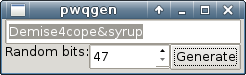
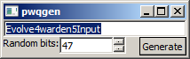

# What is it?

**ipwqgen** is a password generator, frontend to the awesome [passwdqc](http://www.openwall.com/passwdqc/) library.

Each time you generate a password it's copied to the clipboard, so you can paste it immediately. You can vary the strength of the generated passwords.

# What does the application look like?

# Why is passwdqc source in there?

`passwdqc` library needs a few patches to work on Windows (if you just build it using MinGW, it would try to open `/dev/urandom` and fail). I modified `passwdqc_random.c` to use [BCryptGenRandom](https://msdn.microsoft.com/en-us/library/windows/desktop/aa375458%28v%3Dvs.85%29.aspx) instead.

# How do I build the application myself?

1. Get the [IUP](http://webserver2.tecgraf.puc-rio.br/iup/) GUI library. You don't have to install it system-wide; if you're building it from source, just make sure you have all the prerequisites and type `make` in the `src` subdirectory.
2. Use [Premake4](https://premake.github.io/download.html#v4) to generate the build files. Pass the location of IUP header and library files using `--iup-inc` and `--iup-lib` command line arguments.
3. Alternatively, use a one-liner like `gcc -o ipwqgen --std=c99 -Wall -Wextra -Wpedantic -I path/to/IUP/include -L path/to/IUP/lib -I passwdqc passwdqc/passwdqc_parse.c passwdqc/passwdqc_memzero.c passwdqc/passwdqc_random.c passwdqc/concat.c passwdqc/wordset_4k.c passwdqc/passwdqc_load.c gui/gui.c -liup`, it should work.
