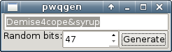
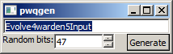

# What is it?

**ipwqgen** is a password generator, frontend to the awesome [passwdqc](http://www.openwall.com/passwdqc/) library.

Each time you generate a password it's copied to the clipboard, so you can paste it immediately. You can vary the strength of the generated passwords.

# Why is passwdqc source in there?

passwdqc library needs a few patches to work on Windows (if you just build it using MinGW, it would try to open `/dev/urandom` and fail).

# What the application looks like?

